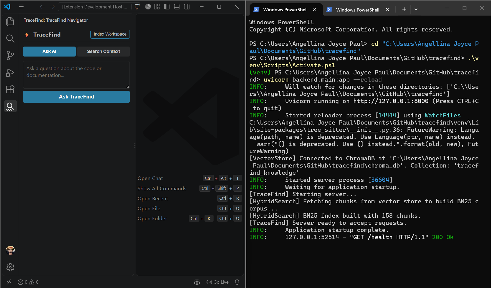

# ⚡ TraceFind
### A 100% local RAG system that answers codebase questions with exact citations — and catches contradictions between documentation and code.

[](https://www.python.org/)
[](https://fastapi.tiangolo.com/)
[](LICENSE)
[](https://ollama.com/)



> **Documentation says one thing. Code does another. TraceFind catches it automatically.**

TraceFind indexes a codebase and its documentation, then answers developer questions with exact `file.py:line` citations. It also detects when the README claims one thing and the code does another — reporting both sources with a confidence score.

Everything runs **100% locally**. No OpenAI. No API keys. No data leaving your machine.

📝 **Read the full write-up:** [How I Built a Local RAG System That Catches Documentation Lies](https://dev.to/angellinajoycepaul/how-i-built-a-local-rag-system-that-catches-documentation-lies-46lo)

---

## 🎯 What It Does

- 🔍 **AST-aware citations** — Parses Python, TypeScript, JavaScript, Java, and Go with Tree-sitter to return precise function/class boundaries and exact line numbers
- ⚡ **Hybrid search** — Combines code-aware BM25 (splits camelCase/snake_case) with semantic embeddings via Reciprocal Rank Fusion and cross-encoder re-ranking
- ⚠️ **Contradiction detection** — Flags divergences where documentation contradicts live code (port mismatches, deprecated auth methods, config drift)
- 🧩 **Minimal context** — Returns only the exact functions needed for a task, reducing token bloat
- 🔒 **Zero cost, completely local** — ChromaDB + Ollama (Llama 3.1 8B). No cloud dependencies.

---

## 🏗️ Architecture

```text
[ Codebase + Docs ]
        │
        ▼
[ 1. AST-Aware Chunking ]      ← Tree-sitter extracts functions/classes
        │
        ▼
[ 2. Dual Indexing ]           ← BM25 (lexical) + ChromaDB (semantic)
        │
        ▼
[ 3. Hybrid Retrieval ]        ← RRF fusion + Cross-Encoder re-ranking
        │
        ▼
[ 4. Grounded Synthesis ]      ← Local Llama 3.1 8B via Ollama
        │
        ▼
[ 5. Contradiction Detection ] ← Cross-source conflict analysis
```

---

## 💡 Example: Contradiction Detection in Action

Given a README that says *"The API runs on port 8080 with JWT auth"* and code that actually uses port 9000 with session cookies:

**Query:** `How is authentication handled in this codebase?`

**TraceFind responds:**

```text
Direct Answer:
Authentication is handled using Session cookie authentication,
as implemented in backend/main.py:182-200.

⚠️  Contradiction Detected
Type:          Configuration & Authentication Mismatch
Source A:      README.md:228-251 (Port 8080 / JWT)
Source B:      server.py:12-18   (Port 9000 / Cookie)
Confidence:    92%
```

---

## 🛠️ Tech Stack

| Layer | Technology |
|-------|-----------|
| **Code Parsing** | Tree-sitter + tree_sitter_languages |
| **Vector Store** | ChromaDB (persistent, cosine similarity) |
| **Embeddings** | all-MiniLM-L6-v2 (sentence-transformers) |
| **Keyword Search** | rank-bm25 with code-aware tokenization |
| **Fusion** | Reciprocal Rank Fusion (k=60) |
| **Re-ranking** | Cross-Encoder (ms-marco-MiniLM-L-6-v2) |
| **LLM** | Llama 3.1 8B via Ollama |
| **Backend** | FastAPI + Uvicorn |
| **Frontend** | VS Code Extension (TypeScript) |

---

## 🚀 Quick Start

### Prerequisites
- Python 3.10+
- Node.js 18+ (for VS Code extension)
- [Ollama](https://ollama.com/) installed

### Setup

```bash
# 1. Clone
git clone https://github.com/AngellinaJoycePaul/TraceFind.git
cd TraceFind

# 2. Create virtual environment
python -m venv venv
# Windows:
.\venv\Scripts\Activate.ps1
# macOS/Linux:
source venv/bin/activate

# 3. Install dependencies
pip install -r requirements.txt

# 4. Pull the local LLM (~4.7 GB)
ollama pull llama3.1:8b

# 5. Start the backend
uvicorn backend.main:app --reload
```

Backend runs on `http://localhost:8000`.  
Interactive API docs: `http://localhost:8000/docs`.

### Index a repository

```bash
python cli/index.py --path /path/to/your/repo
```

### Try it

```bash
# Search
curl -X POST http://localhost:8000/search \
  -H "Content-Type: application/json" \
  -d '{"query": "how does authentication work", "k": 5}'

# Ask with citations + contradiction detection
curl -X POST http://localhost:8000/ask \
  -H "Content-Type: application/json" \
  -d '{"question": "How is authentication handled?", "k": 5}'
```

### VS Code Extension

```bash
cd vscode-extension
npm install
npm run compile
# Open this folder in VS Code and press F5
```

---

## 📦 Project Structure

```text
tracefind/
├── backend/
│   ├── chunker.py         # Tree-sitter AST chunking
│   ├── embedder.py        # SentenceTransformer embeddings with caching
│   ├── vector_store.py    # ChromaDB client
│   ├── hybrid_search.py   # BM25 + Vector + RRF + Cross-Encoder
│   ├── synthesizer.py     # Ollama LLM + contradiction detection
│   └── main.py            # FastAPI endpoints
├── cli/
│   └── index.py           # CLI bulk indexing tool
├── vscode-extension/
│   └── src/extension.ts   # Sidebar UI + backend client
├── requirements.txt
└── README.md
```

---

## 🔌 API Reference

| Endpoint | Method | Purpose |
|----------|--------|---------|
| `/health` | GET | Server status + indexed chunks count |
| `/stats` | GET | Index statistics |
| `/index` | POST | Index a repository directory |
| `/search` | POST | Hybrid search (no LLM) |
| `/ask` | POST | Full pipeline with citations + contradictions |
| `/reset` | POST | Clear the index |

---

## 📖 The Story Behind It

TraceFind started as a hackathon project at **Recursion** (VIT). The venue had no reliable power and unusable WiFi — we dropped out. The repo sat untouched for weeks.

Then I picked it back up at home. No team, no judges, no deadline. Just a project I didn't want to leave half-finished. What you see here is that version.

Full story: [How I Built a Local RAG System That Catches Documentation Lies](https://dev.to/angellinajoycepaul/how-i-built-a-local-rag-system-that-catches-documentation-lies-46lo)

---

## 🗺️ Roadmap

- [ ] Public demo on Hugging Face Spaces
- [ ] Publish VS Code extension to the Marketplace
- [ ] Add test suite
- [ ] Support more Tree-sitter languages (Rust, C++, Ruby)

---

## 📄 License

MIT — see [LICENSE](LICENSE).

---

## 👤 Author

**Angellina Joyce Paul**  
Second-year IT student, building local AI tools for developers.

- GitHub: [@AngellinaJoycePaul](https://github.com/AngellinaJoycePaul)
- Blog: [dev.to/angellinajoycepaul](https://dev.to/angellinajoycepaul)
- LinkedIn: [linkedin.com/in/angellina-joyce-paul-917b24380](https://www.linkedin.com/in/angellina-joyce-paul-917b24380)

If you find a contradiction in your own codebase with TraceFind, I'd love to hear about it.